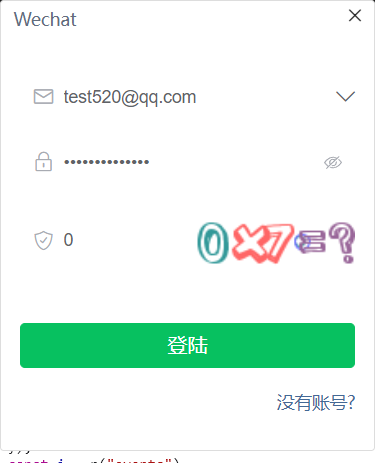
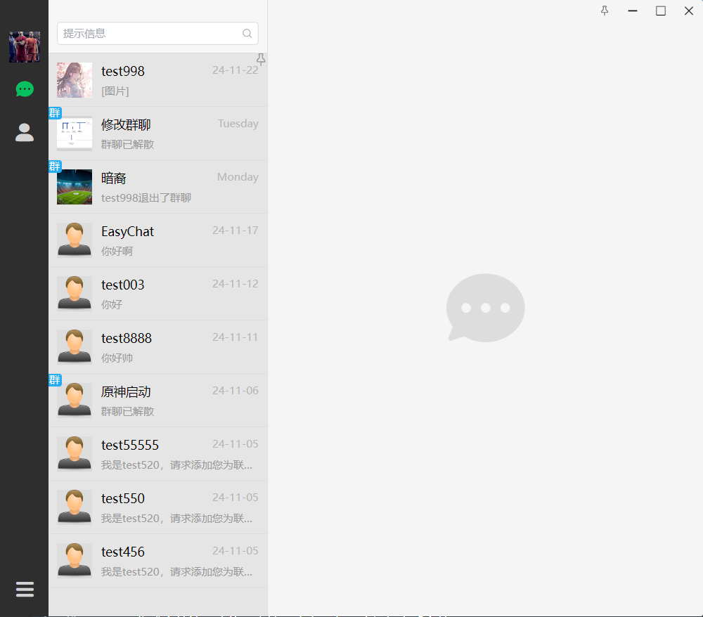
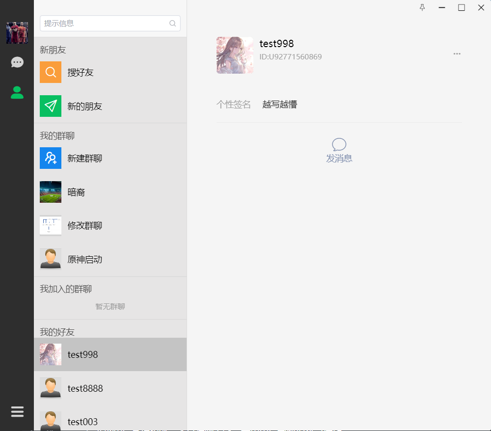
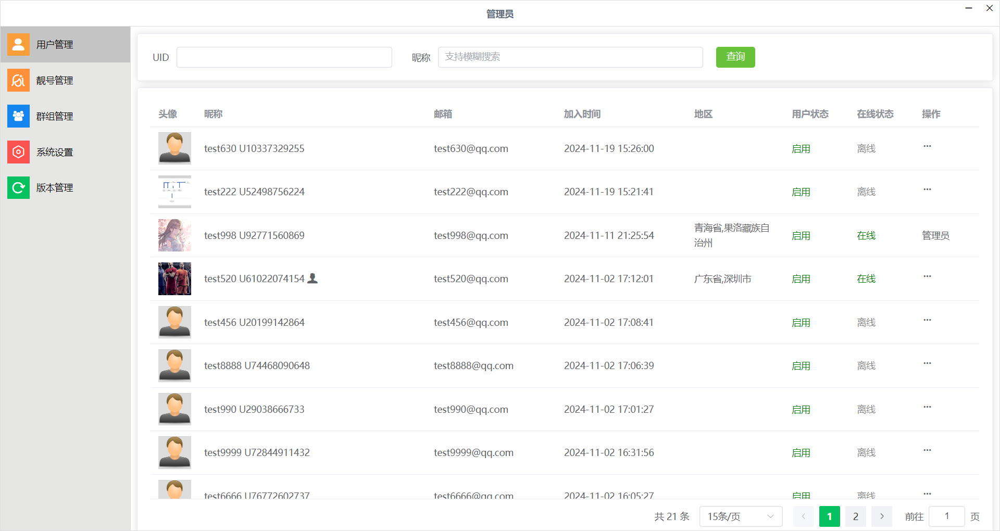

# copyWechat

## 1.项目简介

  copyWeChat 是一个支持即时通信的全功能聊天系统，包含聊天客户端与管理后台两部分，提供用户管理、群组管理、好友管理以及消息提醒等功能。（注：本项目非本人原创，但本人对此具有一些基础功能的优化，并在后续将提供其他未补充的功能的支持）

1.登陆模块:



2.聊天页面



3.联系人页面:

4.用户管理页面



## 2.项目职责

##### **聊天客户端模块**：

1. ###### 实现了用户登录、注册功能，支持新建群聊与添加好友等操作

2. ###### 完成单聊与群聊模块，支持文本、图片、视频等多媒体消息发送。

3. ###### 集成文件管理功能，支持更改本地存储路径与查看文件。

4. ###### 优化会话列表，提供置顶、删除会话的功能，提升用户体验。

##### 管理后台模块:

1. ###### 完成用户管理功能，支持强制下线、禁用用户与新增账号操作。

2. ###### 设计群组管理功能，便捷化群组创建、修改与成员管理。

3. ###### 实现系统版本管理，支持版本发布与更新。

## 3.使用到的技术栈(前端)

  使用框架为Vue3.js+ElentPlus，配合HTML、CSS(此区域使用少量saas变量优化了代码结构)，少数部分直接操作dom的结合实现页面的动态渲染，静态打包工具为Vite,并通过Electron的渲染进程与主进程的交互来进行sqlite操作（包含基本的增删改查，并依照实际查询量进行了少数索引的创建），使用主进程的node环境对文件流的操作和Express服务的开启和关闭，在通信方面提供和WebSocket功能对聊天功能的支持，并在聊天表情包，颜文字上有基础的优化。

## 4.项目部署

### Install

```bash
$ npm install
```

### Development

```bash
$ npm run dev
```

### Build

```bash
# For windows
$ npm run build:win

# For macOS
$ npm run build:mac

# For Linux
$ npm run build:linux
```

## 5.未来规划

1. 尝试加入WebRTC实现视频和语音功能的实现

2. 尝试添加朋友圈功能和点赞功能的实现

3. 可添加内部裁剪功能

4. 尝试引入其他js开源库实现语音转文字功能

   


